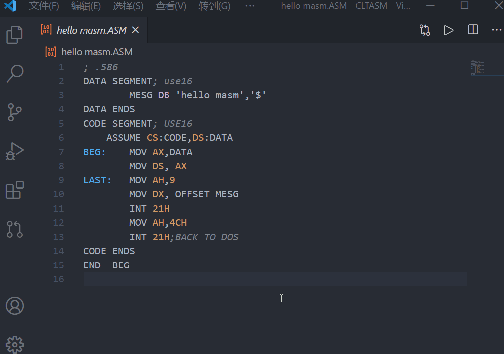
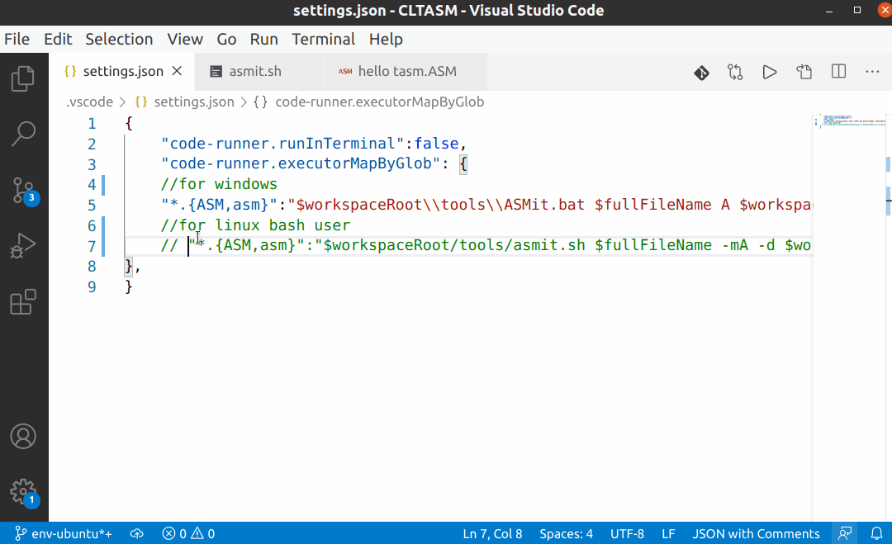

# VSCode custom Tasks for Run TASM/MASM code in DOSBox

[中文](readme.zh.md)|[github](https://github.com/xsro/VSC-ASMtasks)|[gitee](https://gitee.com/chenliucx/VSC-ASMtasks)|[how it works](doc/how-it-work.md)|[release and download](https://github.com/xsro/VSC-ASMtasks/releases)

VSCode's terminal is very powerful while the process of run assembly file of TASM/MASM is a little bit  tedious. So I write some tasks and scrips to simplify the process.Here are some features.Runable in both windows and linux. May be also support OSX. [Getting Start](#getting-start).Click [use this template](https://github.com/xsro/VSC-ASMtasks/generate) to use this template.

## :sweat_smile:Main Features

### Terminal Tasks

#### Run build tasks

Use the *Run build Tasks* with **Ctrl+Shift+B** or click **Terminal->Run Build Tasks**,to run bulid tasks:`MASM CurrentFile` and `TASM CurrentFile`.If so, you will see results in terminal or error messages in problem

For example, A TASM code [hello tasm.ASM](hello%20tasm.ASM) can be successfully compiled witch TASM while if use MASM, it will ouput error messages.

|No problem|several problem|
|------|----------|
|||

Also you can choose `Open Dosbox with TASM/MASM tools added to path` to open dosbox,add TASM and MASM tools to path and copy the current file as T.ASM.


#### Run test task

For more function,you can run test tasks.Press `Ctrl + Shift + P`?MacOS Command + Shift + P?to bring up Command Panel.
Type > Run Test Task into Command Panel.

|

### with **Code Runner**

if installed the vscode extension *code runner*, we can run TASM with a click or **Ctrl+Alt+N**.The relavant setting are in [.vscode/settings.json](.vscode/settings.json)

- if need to use MASM,Just change A to B like
- if in linux,Please make some changes according to comments

```json
"code-runner.executorMapByGlob": {
    //for windows using TASM
    "*.{ASM,asm}":"$workspaceRoot\\tools\\ASMit.bat $fullFileName A $workspaceRoot\\tools $workspaceRoot\\tools\\work",
    //for linux using TASM
    "*.{ASM,asm}":"$workspaceRoot/tools/asmit.sh $fullFileName -mA -d $workspaceRoot/tools"
    //for windows using MASM
    "*.{ASM,asm}":"$workspaceRoot\\tools\\ASMit.bat $fullFileName B $workspaceRoot\\tools $workspaceRoot\\tools\\work",
    //for linux using MASM
    "*.{ASM,asm}":"$workspaceRoot/tools/asmit.sh $fullFileName -mB -d $workspaceRoot/tools"
},
```



## How to use

### Getting Start

Recommend click [use this template](https://github.com/xsro/VSC-ASMtasks/generate) to build your repository using the current file structure.

1. Clone the repository to your folder
   - download release from [here](https://gitee.com/chenliucx/CLTASM/releases)
   - If installed GIT,we can use command like `cd yourfolder;git clone https://github.com/xsro/VSC-ASMtasks.git`
   - Or click`code`,`download zip` and unzip to your folder
2. Open the Folder with VSCode [Download VSCode](https://code.visualstudio.com/Download)
3. Then you can write your own TASM or MASM code with the assitance of the powerful VSCode tasks

#### for linux

For linux, we should **Install the `dosbox` first**.Use command like `sudo apt install dosbox` or download from website[DOSBox](https://www.dosbox.com). Since I have put the dosbox.exe in the folder `ASMtools\dosbox`,so it's not necessary to install dosbox for windows users.Since I use the bash script [asmit.sh](tools/asmit.sh),we need to allow it to run by command like `chmod u+x asmit.sh`.

To use Code Runner ,Please refer to [with Code Runner](#with-code-runner)

## Overview

When I study the NJUPT's course <principles& peripheral technology of microprocessor>, I need to study some knowledge about assembly,but those assembly tools(TASM and MASM) runs in 16 bits microprocessor system which is not supported by most computers today. We use **DOSBox** to emulate the 16-bit environment, but DOSBox is designed for games,it is a little unfriendly for coding. So I write some **VSCode** settings and tasks to run the **TASM** assembly.Hope helpful for you:smiley:

### :file_folder:Content

1. Folder [.vscode](.vscode):tasks.json for Build Task,settings.json mainly for CodeRunner
2. Folder [tools](tools)
   1. dosbox:windows programs of dosbox and config file
   2. TASM: tools(16bit) includes:TASM.exe,Tlink.exe,td.exe and others
   3. MASM: tools(16bit) includes:masm.exe,link.exe,debug.exe and others
   4. work: includes asm.bat which oprating in dosbox folder for operations
   5. ASMit.bat: batch script for run dosbox
   6. asmit.sh:  bash script for run dosbox
3. hello tasm.ASM: A basic TASM code file
4. hello masm.ASM: A basic MASM code file

### :raising_hand:Need your help

Welcome to send issue or pull request

- The dosbox windows is a little bit disturbing. Is there any way to hide it?
- The Code Runner settings is needed to be modified when switching between different OSs.Is there a way to simplify?
- Is there a way to add support for other Editor?

## Find more

Maybe [gitee](https://gitee.com/chenliucx/CLTASM) is helpful to you,which has some codes of TASM,notes about <principles& peripheral technology of microprocessor>.

### notepad++ Users

if you are notepad++ user,maybe this code is helpful to you

```cmd
cmd /c del d:dos\asm\tasm\t.* & copy  "$(FULL_CURRENT_PATH)" "d:dos\asm\tasm\t.asm" & D:\DOS\DOSBox.exe -noautoexec -c "mount c d:dos\asm\tasm"  -c "c:"  -c "tasm/t/zi t.asm" -c "tlink/v/3 t.obj" -c "t.exe" -c "pause" -c "exit"
```
